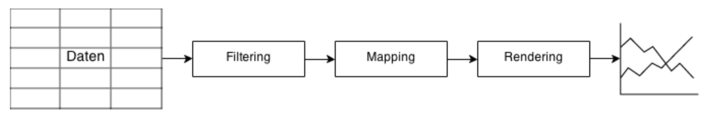
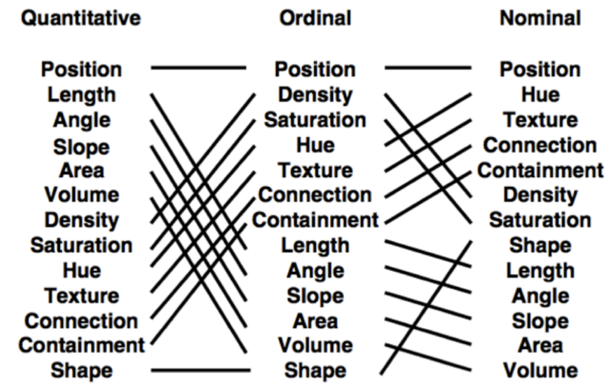

# Visualization
	A Graphic is not drawn once and for all.
Jaques Bertin

## What is Visualization?

* capturing relevant characteristics easier with graphically processed data and information
* a graphic should be understood, recognized and evaluated

## Since?

* goes back to the 10/11 century (astronomy, cartographie, seafaring)
* [Napoleons Campain](https://de.wikipedia.org/wiki/Russlandfeldzug_1812#/media/File:Minard.png)
* [Cholera in Hamburg](https://www.hamburg.de/contentblob/111730/data/grossbuch.pdf)

## Aims / Goals

* finding an appropriate visuell representation of the data
* show inner or hidden structures
* communication of results (fe research results from different scientific topics)

## Why should we use visualization?

* our brains proceed visual information easily
* you can make a boring topic sooo much more interesting to people (this worked the other way around, too...)

## visualisation pipeline

* data: scraping, simulation, observation..
* filtering: data cleaning, calculations, transformations..
* mapping: transform data into a graphical representation, Position, size, shape, color.. 
* rendering: positioning of geometries in space, x-y-Coordinates in charts or long-lat on maps
* graphic: graphic/video with

## D3.js

* data driven documents - coding and thinking based on data
* javascript library combines JS, HTML, SVG and CSS
* easy dom manipulation, interaction, data manipulation, attribut access of svg elements 

* other options.. canvas, webGL, other viz libs

## SVG

* XML-based Markup language
* two-dimensional vector graphics
* basic lines, shapes, text and powerful path's
* the coordinate system may brainfucks you a bit. that happend to everyone.

## Important

* select -> one element
* selectAll -> many elements

* datum -> one dataset
* data -> complex data based on more then one dataset

* rect: x, y, width, height
* circle: cx, cy, r
* line: x, y

## Links

* [D3](https://d3js.org/)
* [SVG on w3](https://www.w3.org/TR/2003/REC-SVG11-20030114/index.html#minitoc)
* [d3 cheat sheet](http://www.jeromecukier.net/wp-content/uploads/2012/10/d3-cheat-sheet.pdf)
* [d3 example](https://jsfiddle.net/1065ts7c)
* [Mozilla Developer Network](https://developer.mozilla.org/en-US/)

